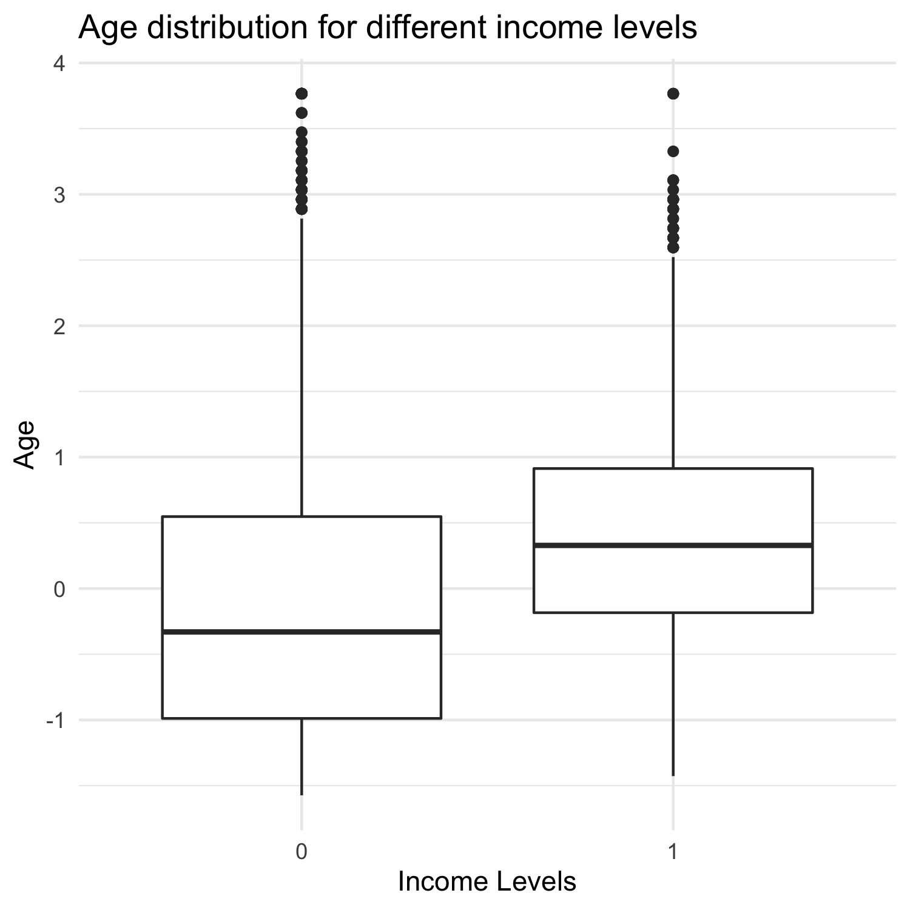
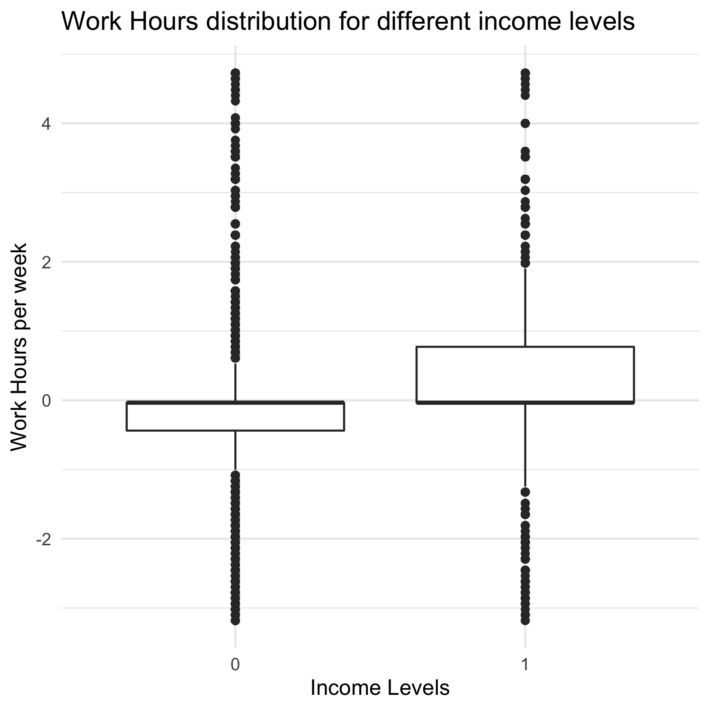

Predicting Income levels of an individual
================
Aishwarya Gopal, Fei Chang, Yanhua Chen
2020/11/29

Summary
=======

Here we attempt to build a classification model using the Logistic
Regression algorithm which uses a set of features like age, workclass,
education etc to classify the income levels of an indivdual into one of
the two categories: &gt;$50k/year or &lt;=$50k/year. The target class
&gt;=50k was encoded as 1 and the other class as 0. Our final Logistic
Regression model performed well on the test data set. We obtained an f1
score of 0.69 and an overall accuracy calculated to be 0.81. It
correctly predicted the income class of 7932 individuals. However it
incorrectly predicted 1837 examples.

Introduction
============

“A large income is the best recipe for happiness I ever heard of” quotes
the famous English novelist Jane Austen. While it might not be the only
recipe, income dictates the standard of living and economic status of an
individual. So, we decided to study the income distribution of people
with different education levels, years of experience etc. The
observations in this data set are classified according to income levels,
into two categories(&gt;$50k/year or &lt;=$50k/year). This data set
comprises of numbers from many countries around the world but, about 90%
of the data has been collected from the USA. So, we are under the
assumption that, the median wage required to lead a life in the USA (at
the time this data was collected) i.e. $50k per year, was chosen as a
threshold for classification.

Taking into account, the importance and impact of income levels in
determining a nation’s growth, this study aims to present meaningful
insights regarding the same.

Methods
=======

Data
----

The data set used in this project is of income census created by Ronny
Kohavi and Barry Becker. It was sourced from the UCI Machine Learning
Repository and can be found
[here](https://archive.ics.uci.edu/ml/machine-learning-databases/adult/),
specifically [this
file](https://archive.ics.uci.edu/ml/machine-learning-databases/adult/adult.data).
The data contains information such as age, workclass, education etc. The
target variable is income and it is divided into two categories
(&lt;=50K and &gt;50K). The ultimate aim is to train a classifier to
predict the income class.

Analysis
--------

The logistic regression algorithm was used to build a classification
model to predict whether an individual earns &gt;$50k/year or
&lt;=$50k/year. All the variables in original data set except for
education.num column was used. The education.num column is just a
numerical representation of the education level of an individual. We
chose to do one-hot encoding on the education column and use that
instead. f1 score was chosen as the desired metric and a 10 fold
cross-validation was performed on the train set. The R and Python
programming languages (R Core Team 2019; Van Rossum and Drake 2009) and
the following R and Python packages were used to perform the analysis:
docopt (de Jonge 2018), knitr (Xie 2014), tidyverse (Wickham et al.
2019), docopt (Keleshev 2014), os (Van Rossum and Drake 2009), Pandas
(McKinney 2010). The code used to perform the analysis and create this
report can be found here:
<a href="https://github.com/UBC-MDS/DSCI_522_Group_18" class="uri">https://github.com/UBC-MDS/DSCI_522_Group_18</a>.

Results & Discussion
====================

To look at the realationship between some of the predictors and the
income class, we plotted the graphs of a few predictors according to the
class distribution. In the first plot, we aim to visualise the age
distribution for different income levels. From the plot, we can infer
that, people in the higher age range, were in the higher income class.
Experience surely plays a role in deciding the income level.

Figure 1. Comparison of income levels w.r.t. age.

The relationship between work hours per week and income class is the one
that we seek to explore next. Individuals with income &gt;50k have
longer average working hours per week than individuals with &lt;50k. But
there are some individuals who have income &lt;50k, but have higher work
hours.

Figure 1. Comparison of income levels w.r.t. average work hours per
week.

We chose to build a simple classification model. To find the model that
best predicted whether an individual earns &gt;50k or &lt;=50k, we
performed 10-fold cross validation using the Logistic regression
algorithm and Random Forest Classification. We observed that the Random
Forest Classification generates a higher training accuracy and f1 score,
however, its advantage in cross-validation scores is not obvious.
Meanwhile, the gap between train and cross-validation score is very
large in Random Forest Classification, which indicates the model is
overfitted. At this point, we decide to use Logistic Regression
algorithm to build the prediction model.

<table class="table" style="width: auto !important; margin-left: auto; margin-right: auto;">
<caption>
Table 1. Cross validate scores of model performance on train data.
</caption>
<thead>
<tr>
<th style="text-align:left;">
X
</th>
<th style="text-align:right;">
DummyClassifier
</th>
<th style="text-align:right;">
LogisticRegression
</th>
<th style="text-align:right;">
RandomForestClassifier
</th>
</tr>
</thead>
<tbody>
<tr>
<td style="text-align:left;">
fit\_time
</td>
<td style="text-align:right;">
0.0412552
</td>
<td style="text-align:right;">
3.5960651
</td>
<td style="text-align:right;">
9.0511725
</td>
</tr>
<tr>
<td style="text-align:left;">
score\_time
</td>
<td style="text-align:right;">
0.0089719
</td>
<td style="text-align:right;">
0.0071255
</td>
<td style="text-align:right;">
0.1983538
</td>
</tr>
<tr>
<td style="text-align:left;">
test\_accuracy
</td>
<td style="text-align:right;">
0.6356625
</td>
<td style="text-align:right;">
0.8099776
</td>
<td style="text-align:right;">
0.8564407
</td>
</tr>
<tr>
<td style="text-align:left;">
train\_accuracy
</td>
<td style="text-align:right;">
0.6353399
</td>
<td style="text-align:right;">
0.8109034
</td>
<td style="text-align:right;">
0.9999415
</td>
</tr>
<tr>
<td style="text-align:left;">
test\_f1
</td>
<td style="text-align:right;">
0.2411761
</td>
<td style="text-align:right;">
0.6819067
</td>
<td style="text-align:right;">
0.6703239
</td>
</tr>
<tr>
<td style="text-align:left;">
train\_f1
</td>
<td style="text-align:right;">
0.2408215
</td>
<td style="text-align:right;">
0.6838377
</td>
<td style="text-align:right;">
0.9998782
</td>
</tr>
</tbody>
</table>

Our prediction model performed quite well on test data, the confusion
matrix below indicates it only made 1837 mistakes. However, most of the
mistake are from the “&gt;=50K” group.

<table class="table" style="width: auto !important; margin-left: auto; margin-right: auto;">
<caption>
Table 2. Confusion matrix of model performance on test data.
</caption>
<thead>
<tr>
<th style="empty-cells: hide;border-bottom:hidden;" colspan="1">
</th>
<th style="border-bottom:hidden;padding-bottom:0; padding-left:3px;padding-right:3px;text-align: center; " colspan="2">

Reference

</th>
</tr>
<tr>
<th style="text-align:left;">
</th>
<th style="text-align:right;">
&lt;50k
</th>
<th style="text-align:right;">
&gt;=50k
</th>
</tr>
</thead>
<tbody>
<tr grouplength="2">
<td colspan="3" style="border-bottom: 1px solid;">
<strong>Predicted</strong>
</td>
</tr>
<tr>
<td style="text-align:left; padding-left:  2em;" indentlevel="1">
&lt;50k
</td>
<td style="text-align:right;">
5929
</td>
<td style="text-align:right;">
1473
</td>
</tr>
<tr>
<td style="text-align:left; padding-left:  2em;" indentlevel="1">
&gt;=50k
</td>
<td style="text-align:right;">
364
</td>
<td style="text-align:right;">
2003
</td>
</tr>
</tbody>
</table>

This problem is also reflected by the classification report, that the
f1.score of “&gt;=50k” group is much lower than “&lt;50k” group. This
model is not good enough to yet predict the income status of rich
people.

<table class="table" style="width: auto !important; margin-left: auto; margin-right: auto;">
<caption>
Table 3. Classification report of model performance on test data.
</caption>
<thead>
<tr>
<th style="text-align:left;">
X
</th>
<th style="text-align:right;">
precision
</th>
<th style="text-align:right;">
recall
</th>
<th style="text-align:right;">
f1.score
</th>
<th style="text-align:right;">
support
</th>
</tr>
</thead>
<tbody>
<tr>
<td style="text-align:left;">
&lt;50k
</td>
<td style="text-align:right;">
0.9421580
</td>
<td style="text-align:right;">
0.8009997
</td>
<td style="text-align:right;">
0.8658635
</td>
<td style="text-align:right;">
7402.0000000
</td>
</tr>
<tr>
<td style="text-align:left;">
&gt;=50k
</td>
<td style="text-align:right;">
0.5762371
</td>
<td style="text-align:right;">
0.8462188
</td>
<td style="text-align:right;">
0.6856067
</td>
<td style="text-align:right;">
2367.0000000
</td>
</tr>
<tr>
<td style="text-align:left;">
accuracy
</td>
<td style="text-align:right;">
0.8119562
</td>
<td style="text-align:right;">
0.8119562
</td>
<td style="text-align:right;">
0.8119562
</td>
<td style="text-align:right;">
0.8119562
</td>
</tr>
<tr>
<td style="text-align:left;">
macro avg
</td>
<td style="text-align:right;">
0.7591975
</td>
<td style="text-align:right;">
0.8236093
</td>
<td style="text-align:right;">
0.7757351
</td>
<td style="text-align:right;">
9769.0000000
</td>
</tr>
<tr>
<td style="text-align:left;">
weighted avg
</td>
<td style="text-align:right;">
0.8534964
</td>
<td style="text-align:right;">
0.8119562
</td>
<td style="text-align:right;">
0.8221878
</td>
<td style="text-align:right;">
9769.0000000
</td>
</tr>
</tbody>
</table>

To further improve this model in future, there are several things we can
suggest. First, we could consider to add some hyperparameters to control
the machine learning process to get a better model. Second, we could
look through the model to see if there are any feature(s) driving to a
misclassification and explore whether any feature engineering could be
used to help the model better predict on observations that it currently
is making mistakes on.

References
==========

de Jonge, Edwin. 2018. *Docopt: Command-Line Interface Specification
Language*. <https://CRAN.R-project.org/package=docopt>.

Keleshev, Vladimir. 2014. *Docopt: Command-Line Interface Description
Language*. <https://github.com/docopt/docopt>.

McKinney. 2010. “Data Structures for Statistical Computing in Python.”
In *Proceedings of the 9th Python in Science Conference*, edited by
Stéfan van der Walt and Jarrod Millman, 56–61.
[https://doi.org/ 10.25080/Majora-92bf1922-00a](https://doi.org/%2010.25080/Majora-92bf1922-00a%20).

R Core Team. 2019. *R: A Language and Environment for Statistical
Computing*. Vienna, Austria: R Foundation for Statistical Computing.
<https://www.R-project.org/>.

Van Rossum, Guido, and Fred L. Drake. 2009. *Python 3 Reference Manual*.
Scotts Valley, CA: CreateSpace.

Wickham, Hadley, Mara Averick, Jennifer Bryan, Winston Chang, Lucy
D’Agostino McGowan, Romain François, Garrett Grolemund, et al. 2019.
“Welcome to the tidyverse.” *Journal of Open Source Software* 4 (43):
1686. <https://doi.org/10.21105/joss.01686>.

Xie, Yihui. 2014. “Knitr: A Comprehensive Tool for Reproducible Research
in R.” In *Implementing Reproducible Computational Research*, edited by
Victoria Stodden, Friedrich Leisch, and Roger D. Peng. Chapman;
Hall/CRC. <http://www.crcpress.com/product/isbn/9781466561595>.

