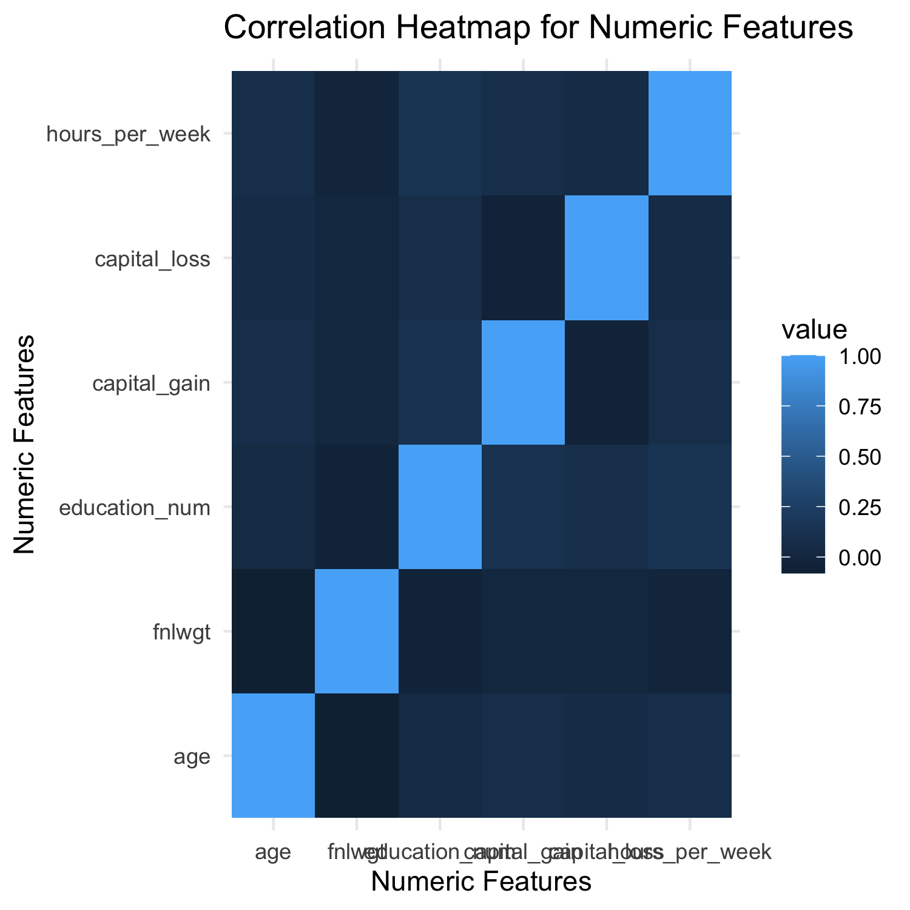
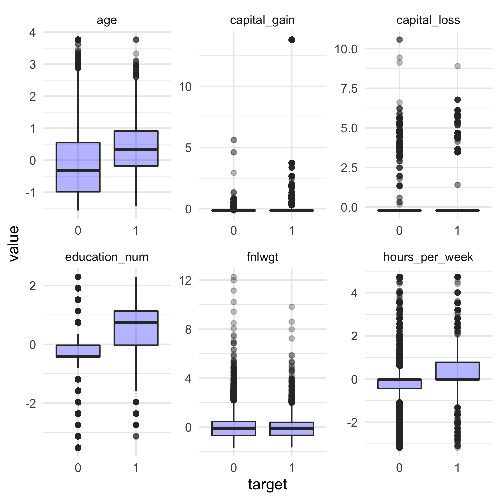

```{r setup, include=FALSE}
knitr::opts_chunk$set(echo = FALSE, warning = FALSE, message=FALSE)
library(tidyverse)
library(knitr)
library(ggplot2)
library(reshape2)
set.seed(2020)
```

# Summary of the data set


```{r load data}
census_data <- read.csv("../data/raw/adult.csv", header = FALSE, col.names = c("age", "workclass", "fnlwgt", "education", "education-num", "marital-status", "occupation", "relationship", "race", "sex", "capital-gain", "capital-loss", "hours-per-week", "native-country", "income")) 

census_data %>% head(10)
```

The data set used in this project is of income census created by Ronny Kohavi and Barry Becker. It was sourced from the UCI Machine Learning Repository [@Dua2019] and can be found [here](https://archive.ics.uci.edu/ml/machine-learning-databases/adult/), specifically [this file](https://archive.ics.uci.edu/ml/machine-learning-databases/adult/adult.data). The data contains information such as age, workclass, education etc. The target variable is income and it is divided into two categories (<=50K and >50K). The ultimate aim is to train a classifier to predict the income class. There are `r nrow(census_data)` observations in the data set, and `r ncol(census_data) - 1` features.

## Column Data types and missing values

```{r echo=FALSE}
census_data <- census_data %>%
  mutate_all(~replace(., . == " ?", NA))

column_types <- split(names(census_data),sapply(census_data, function(x) paste(class(x), collapse=" ")))

cat_columns <- column_types$character

numeric_columns <- column_types$integer

kable(bind_rows(Column = colnames(census_data), missingValues = colSums(is.na(census_data))),
      caption = "Table 2. Count of missing values for each feature")

census_data
```
From the above results, we can see that the numeric columns do not have any missing values. Only three categorical columns, workclass, occupation and native.country have some missing values. We can use the most frequent strategy to impute these missing values.

The column education is just a string representation of the column education.num and hence can be dropped.

## Examining if there is any class imbalance
```{r echo=FALSE}

results <- census_data %>%
  group_by(income) %>%
  summarise(no_of_rows = length(income))

kable(bind_rows(income = results$income, count = results$no_of_rows),
      caption = "Table 2. Counts of observation for each class")
```


From the above table, we can notice that class imbalance is significant and certain techniques have to be employed to address class imbalance. This will help improve the model performance.

## Correlation Heatmap for numeric variables

A regression coefficient is interpreted as "the change in the output for every 1 unit change in an input variable, while holding all other input variables constant". However, when two numeric input variables are highly correlated, it is almost impossible to change the value of one input variable without changing the other. Hence, the coefficients become very sensitive to small changes in the model and the coefficient estimates tend to swing wildly.

Therefore, it is important to check the data set for the presence of collinearity.

```{r echo=FALSE}


```
From the above correlation heatmap, we can observe that none of the numeric variables seem to be highly correlated.


## Exploring the relationship between numeric features and target variables
```{r}



```
The box plots of all scaled numeric features categorized by the target variable is presented above. The target 0 is <50k and the target 1 is >=50k.
From the above plot, it can be inferred that, in general as age increases, i.e. experience level increases, there tends to be higher income levels. 
Individuals with income >50k have longer average working hours per week than individuals with <50k. But there are some individuals who have income <50k, but have higher work hours.
Another important inference is that people with higher education levels earn more on an average than people with lower education levels.
Other numerical variables such as capital_loss and capital_gain tend to have very low median values but have a significantly high number of outliers.


